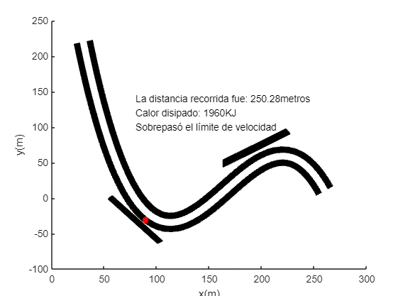

# Formula-1-Simulation
## Formula 1 racing is a significant attraction for all generations, owing to the high speeds achieved by drivers on straights, their ability to handle curves, and the vibrant atmosphere experienced from the stands.

Given this context I designmed a curve section of a new Formula 1 track for the Suzuka GP track in Japan. The objective is to ensure the safety of spectators while providing optimal visibility from the grandstand. To meet these requirements, I have developed a simulation of a car's movement entering the curve zone, illustrating two possible scenarios: the car exiting the track in the event of an accident and the normal trajectory of the car without any incidents.

